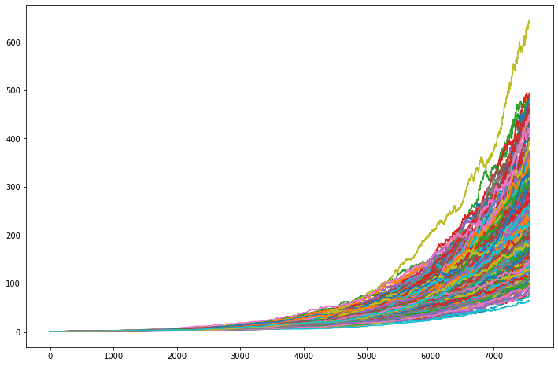
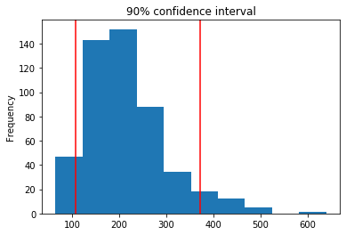

# Report for Homework_API
## Monte Carlo Simulation
Given the simulation and past data info, we have the following visualization and histgram.

**Simulation**

**90% Confidence Interval**

Following is the summary of investment results regarding different initial investment.

|  | Cumulative Returns | 20000 Investment| 
| --- | ----------- | ------------ |
| 10%  Quantile | 123.840374 |2.476807e+06
| 50% Quantile | 202.620688 |4.052414e+06
| 90% Quantile | 320.696010 |6.413920e+06

## Financial Planner

Given the current projected annual income from the Plaid analysis, a 4% withdraw rate from the retirement portfolio will exceed that value at the 10th percentile.

And the retirement income with a 50% increase in the initial investment amount `97301.92530082625`.

